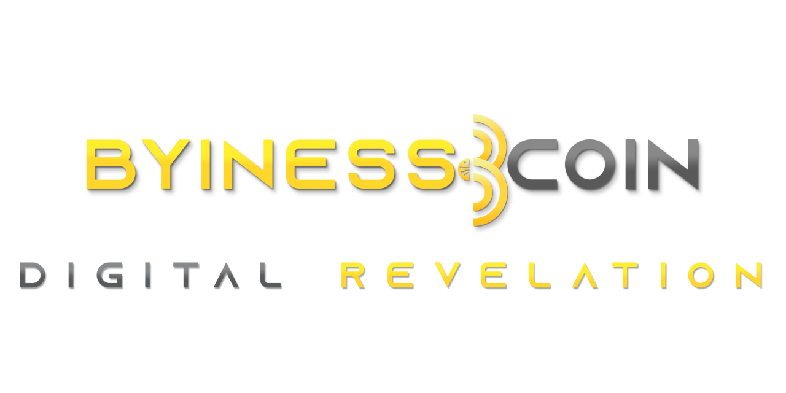

Specifications:
==================

• Name:             Byiness Coin - Digital Revelation

• Ticker:           BYC

• PoW Algorithm:    SHA-256

• P2P Port:         6886

• RPC Port:         6885

• Block Size:       64MB

• Block Time:       1 minute

• Difficulty Time:  1 block

---

• Premine:          1,280,000 BYC

• Maturity:         100 Confirmations  

• Max Supply:       16,000,000 BYC

---

• 51% attacks resistant

• Segwit BYC adresses start with "B" 

• Legacy BYC adresses start with "b"

• Transaction per second (TPS): 1,066

• Halving time: every 73,600 blocks – 51 days approximately

• Uses the "ByinessCoinDifficulty" difficulty algorithm (fork of DGW) for a more stable POW mining process over the network

---

Links:
==================

• [Website](https://byinesscoin.com/)

• [Explorer](https://scan.byinesscoin.com/)

• [Mining Pool](https://mine.byinesscoin.com)

• [Telegram](https://t.me/byinesscoin)

• [Web Wallet](https://byinesswallet.com)

---

License
-------

Byiness Coin - Digital Revelation is released under the terms of the MIT license. See [COPYING](COPYING) for more
information or see http://opensource.org/licenses/MIT.

